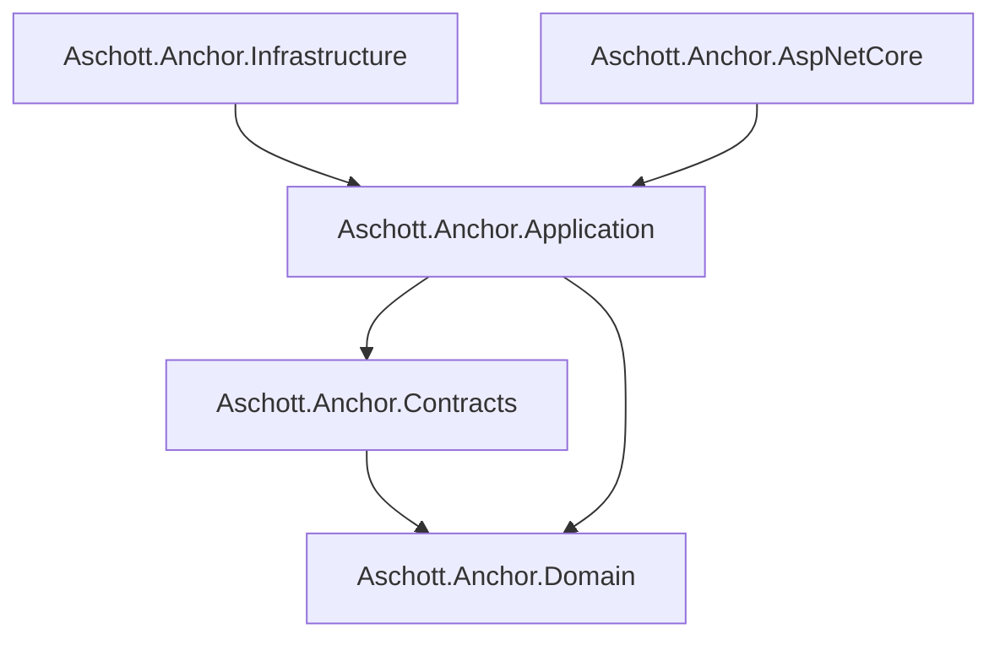

# Anchor — Building blocks

The framework ships as five core packages. This document is the consumer-facing reference for what each one provides, how they depend on each other, and what a minimum-viable usage looks like for each.

> **Status — v0.1.0-preview.1 (F1).** Surface area covers DDD primitives, CQRS pipeline, EF persistence (BaseDbContext + audit + multi-tenant filters), and AspNetCore plumbing (IEndpoint discovery + tenant resolver chain + error middleware). Modules (Tenants, Identity, Auth, Permissions, Audit, Jobs, BlobStore, Notifications, Settings, Localization) arrive starting in F3.

---

## Overview

| Package | Layer | Purpose |
|---|---|---|
| `Aschott.Anchor.Domain` | Domain | DDD primitives: `Entity<TKey>`, `AggregateRoot<TKey>`, `IAggregateRoot`, `ValueObject`, `MultiTenantEntity<TKey>` + `IMultiTenant`, `DomainEvent`, `IAuditedObject`. |
| `Aschott.Anchor.Contracts` | Cross-module | Wire-format abstractions exchanged between modules: `IntegrationEvent`, marker interfaces (`IPermissionDefinitionProvider`, `IFeatureDefinitionProvider`, `ISettingDefinitionProvider`). No infrastructure deps. |
| `Aschott.Anchor.Application` | Application | CQRS markers (`ICommand<T>`, `IQuery<T>`, handlers), `IUnitOfWork`, `ICurrentTenant`, `IDomainEventDispatcher`/`IDomainEventCollector`, 5 pipeline behaviors (Logging, TenantContext, Validation, UnitOfWork, DomainEventDispatch), `AddAnchorApplication(...)` DI extension. |
| `Aschott.Anchor.Infrastructure` | Infrastructure | EF Core persistence: `BaseDbContext` (audit + multi-tenant stamping on `SaveChangesAsync`), `AuditConventions` + `MultiTenantQueryFilters` ModelBuilder extensions, `IRepository<TEntity, TKey>`, `IApplicationDbContext`, `CurrentTenantAccessor` (AsyncLocal). |
| `Aschott.Anchor.AspNetCore` | Web | `IEndpoint` route-mapping contract + assembly-scan registration, tenant resolver chain (`Header`, `Claim`, `Host`, `QueryString`), `TenantContextMiddleware`, `AnchorExceptionHandlingMiddleware`, `ApiResults.Problem(...)`, `AddAnchorAspNetCore`/`UseAnchorAspNetCore`. |
| `Aschott.Anchor` | Façade | Single-package reference path that pulls in all 5 building blocks (per ADR 0002). Module extensions plug in here in later milestones. |

---

## Dependency graph



The arrows mean "references". The graph is enforced architecturally by `Aschott.Anchor.Architecture.Tests` (NetArchTest), so a future PR that violates a boundary (e.g. an AspNetCore type taking a hard dependency on Infrastructure) breaks the build.

---

## Minimum-viable examples

### `Aschott.Anchor.Domain`

```csharp
using Aschott.Anchor.Domain.Entities;
using Aschott.Anchor.Domain.Events;
using Aschott.Anchor.Domain.ValueObjects;

public sealed record CustomerCreated(Guid CustomerId, string Email) : DomainEvent;

public sealed class Email : ValueObject
{
    public string Value { get; }
    public Email(string value) => Value = value.Trim().ToLowerInvariant();
    protected override IEnumerable<object?> GetEqualityComponents() { yield return Value; }
}

public sealed class Customer : MultiTenantEntity<Guid>
{
    public Email Email { get; private set; } = default!;

    private Customer() { }
    public Customer(Guid id, Guid tenantId, Email email) : base(id, tenantId)
    {
        Email = email;
        RaiseDomainEvent(new CustomerCreated(id, email.Value));
    }
}
```

### `Aschott.Anchor.Application`

```csharp
using Aschott.Anchor.Application.Cqrs;
using Aschott.Anchor.Application.MultiTenancy;
using FluentResults;

[RequiresTenant]
public sealed record CreateCustomer(string Email) : ICommand<Guid>;

internal sealed class CreateCustomerHandler : ICommandHandler<CreateCustomer, Guid>
{
    public async ValueTask<Result<Guid>> Handle(CreateCustomer request, CancellationToken ct)
    {
        // ...persist via repository...
        return Result.Ok(Guid.NewGuid());
    }
}
```

### `Aschott.Anchor.Infrastructure`

```csharp
using Aschott.Anchor.Application.MultiTenancy;
using Aschott.Anchor.Infrastructure.Persistence;
using Microsoft.EntityFrameworkCore;

public sealed class AppDbContext(DbContextOptions options, ICurrentTenant currentTenant)
    : BaseDbContext(options, currentTenant)
{
    public DbSet<Customer> Customers => Set<Customer>();
}
```

`BaseDbContext` automatically:
- adds the multi-tenant query filter to every `IMultiTenant` entity;
- stamps `CreatedAt`/`UpdatedAt` for any `IAuditedObject` on `SaveChangesAsync`;
- sets `TenantId` on newly added `IMultiTenant` entries when the aggregate didn't supply one.

### `Aschott.Anchor.AspNetCore`

```csharp
using Aschott.Anchor.AspNetCore.Endpoints;
using Mediator;

public sealed class CreateCustomerEndpoint : IEndpoint
{
    public void MapEndpoint(IEndpointRouteBuilder app) =>
        app.MapPost("/customers", async (CreateCustomer cmd, IMediator mediator) =>
        {
            var result = await mediator.Send(cmd);
            return result.IsSuccess
                ? Results.Created($"/customers/{result.Value}", new { id = result.Value })
                : Aschott.Anchor.AspNetCore.Errors.ApiResults.Problem(result.Errors);
        });
}
```

### Wiring it together (consumer `Program.cs`)

```csharp
using Aschott.Anchor.Application.DependencyInjection;
using Aschott.Anchor.Application.MultiTenancy;
using Aschott.Anchor.AspNetCore.DependencyInjection;
using Aschott.Anchor.AspNetCore.Endpoints;
using Aschott.Anchor.Infrastructure.MultiTenancy;
using Microsoft.EntityFrameworkCore;

var builder = WebApplication.CreateBuilder(args);

builder.Services
    .AddDbContext<AppDbContext>(opts => opts.UseNpgsql(builder.Configuration.GetConnectionString("Db")))
    .AddScoped<ICurrentTenant, CurrentTenantAccessor>()
    .AddAnchorApplication(typeof(Program).Assembly)        // pipeline behaviors + validators
    .AddAnchorEndpoints(typeof(Program).Assembly)          // discover IEndpoint impls
    .AddAnchorAspNetCore()                                  // tenant resolver chain
    .AddMediator();                                         // emitted by Mediator's source generator

var app = builder.Build();

app.UseRouting();
app.UseAnchorAspNetCore();      // exception handler + tenant context middleware
app.UseEndpoints(e => e.MapAnchorEndpoints());

app.Run();
```

---

## Pipeline order

`AddAnchorApplication` registers behaviors in this order, which is also the runtime execution order in Mediator 3.x:

```
Logging  →  TenantContext  →  Validation  →  UnitOfWork  →  DomainEventDispatch
```

| Behavior | Responsibility |
|---|---|
| `LoggingBehavior` | Entry/exit/duration logs. Tags an `ActivitySource` for OpenTelemetry. Logs and rethrows exceptions. |
| `TenantContextBehavior` | If the request type is `[RequiresTenant]` and `ICurrentTenant.Id` is null, throws. Otherwise no-op. |
| `ValidationBehavior` | Runs all registered `IValidator<TRequest>`s. On failures, returns `Result<T>.Fail(...)` if `TResponse` is `Result<T>`, else throws `ValidationException`. |
| `UnitOfWorkBehavior` | If `TRequest : ICommand<>` and `next()` succeeded, calls `IUnitOfWork.SaveChangesAsync`. Queries skip the commit; exceptions bypass it (implicit rollback). |
| `DomainEventDispatchBehavior` | Collects events from aggregates tracked via `IDomainEventCollector`, dispatches them through `IDomainEventDispatcher`, then clears the aggregates. |

---

## Multi-tenancy quick model

1. Inherit `MultiTenantEntity<TKey>` for tenant-scoped aggregates. Inherit `AggregateRoot<TKey>` directly for host-level data.
2. Inject `ICurrentTenant`. Use `currentTenant.Change(tenantId)` to scope a unit of work; the `IDisposable` reverts on dispose.
3. `BaseDbContext` adds an automatic query filter `e.TenantId == currentTenant.Id || currentTenant.Id == null` on every `IMultiTenant` entity. Setting `currentTenant.Id` to `null` enables host-level queries.
4. AspNetCore's resolver chain (Header → Claim → Host) populates `ICurrentTenant.Id` per request via `TenantContextMiddleware`. The first non-null resolution wins; consumers can register `QueryStringTenantResolver` for development-only flows.

---

## Consuming preview packages from GitHub Packages

While F1 ships as preview (`v0.1.0-preview.*`), packages live on GitHub Packages, not nuget.org. Add to your repo's `nuget.config`:

```xml
<configuration>
  <packageSources>
    <add key="anchor-preview" value="https://nuget.pkg.github.com/andersonschott/index.json" />
  </packageSources>
  <packageSourceCredentials>
    <anchor-preview>
      <add key="Username" value="USERNAME" />
      <add key="ClearTextPassword" value="GITHUB_PAT_WITH_read:packages" />
    </anchor-preview>
  </packageSourceCredentials>
</configuration>
```

Then reference packages with `<PackageReference>` (versions managed centrally via `Directory.Packages.props`). Stable releases will move to nuget.org under the same `Aschott.Anchor.*` IDs.

---

## FAQ

**Why 5 building blocks instead of ABP's 7?**
Anchor folds ABP's `Domain.Shared` into `Domain` (no separate "shared kernel" — the framework is small enough that a single `Domain` package covers DDD primitives without bleeding into module-level types) and folds `Application.Contracts` into `Contracts` (one package per cross-module wire surface, regardless of whether it's a query DTO or an integration event). Modules in F3+ still keep their own per-module `Domain`/`Application`/`Contracts`/`Infrastructure`/`Endpoints` projects.

**Why no `Aschott.Anchor.Domain.Shared` package?**
Same answer: until we have multiple modules whose `Domain` types collide, splitting `Domain` from `Domain.Shared` is a premature abstraction. We can add `Domain.Shared` in a later major version if a real consumer hits the seam.

**Why `Mediator` (martinothamar) instead of `MediatR`?**
MediatR 12.0+ moved to BSL (commercial). Anchor's license policy bans BSL/SSPL-only deps. Mediator (Apache 2.0) is the closest API-compatible source-generated equivalent.

**Why `Shouldly` instead of `FluentAssertions`?**
FluentAssertions 8.0+ is now commercial under Xceed. Pinning at FA 7.x is allowed but reinforces the bait-and-switch pattern Anchor's policy is designed to avoid. Shouldly is BSD-2-Clause and stays free.

**Why isn't `AddMediator` called inside `AddAnchorApplication`?**
Mediator 3.x's `AddMediator` is emitted via source generator at the consuming assembly. The framework registers its own pipeline behaviors via `AddAnchorApplication`; consumers call `services.AddMediator(...)` themselves to register their own handlers.

**Where do I put my own architectural rules?**
The placeholder rules in `Aschott.Anchor.Architecture.Tests` (handler visibility, command/query shape, endpoint placement, tenant inheritance, domain-event shape) are documented stubs that activate against module assemblies starting in F3. For application-specific rules, copy that test project into your own solution and adapt.

---

See also: [ADR 0002 — Forma do pacote raiz Aschott.Anchor](adr/0002-aschott-anchor-root-shape.md).
